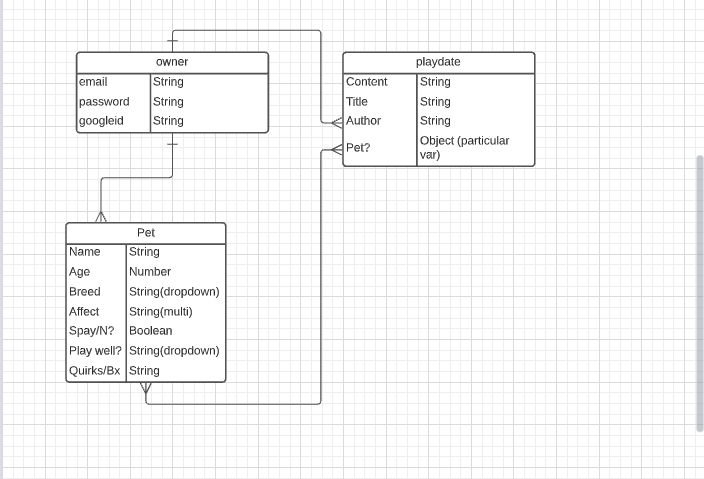
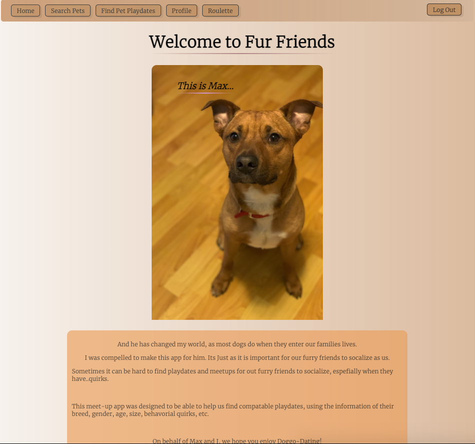
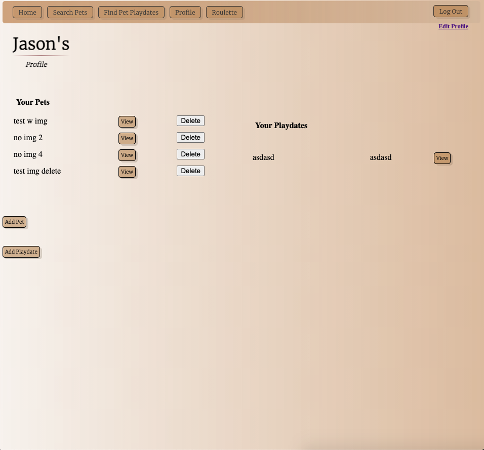
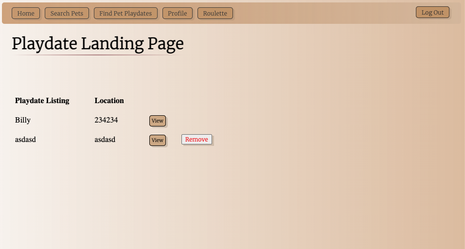
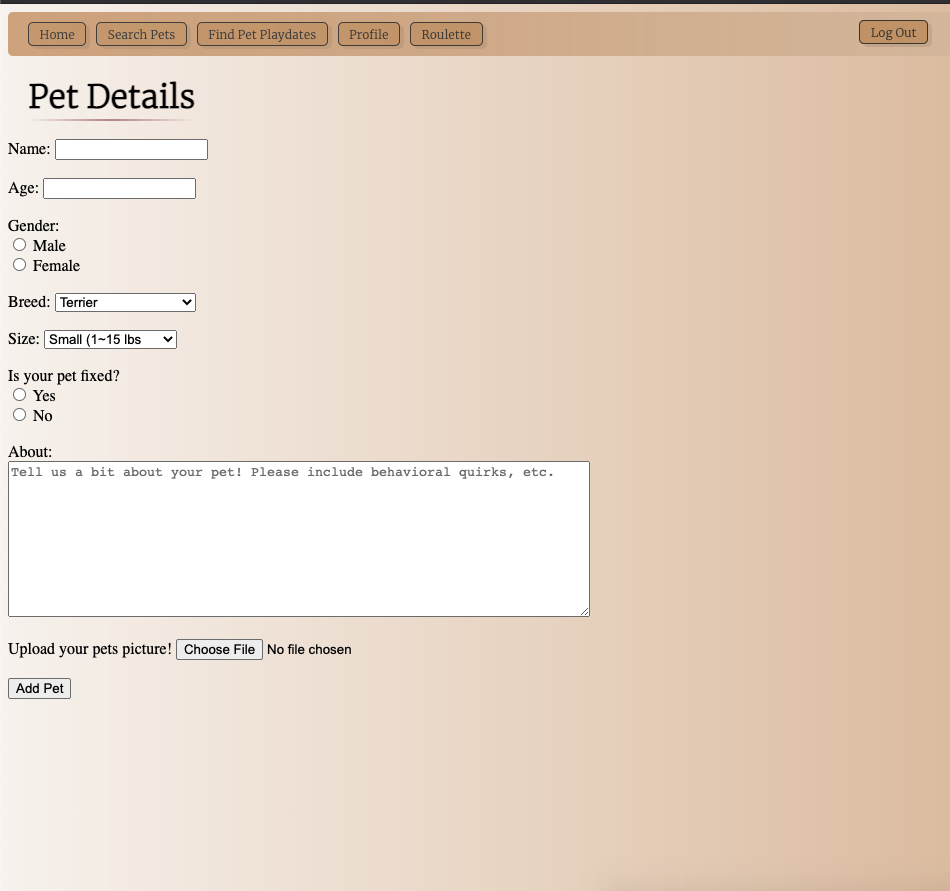

<h1>Welcome to Animal Friends!</h1>
Just as much as us homans need to socialize and interace, so do our Furry Friends. 
So i decided to make this app, as a playdate finder for our furry companions.
My dog, Max, has changed my life, and so i found it fitting to make something on his behalf 
 
 
You can create a login and start exploring this app:
<ul>
  <li>create a pet profile</li>
  <li>Search other pets</li>
  <li>Look for playdates</li>
  <li>View other dogs profiles</li>
  <li>create a playdate</li>
  <li>add your pet to others playdate</li>
  <li>Go to 'Roulette' and see a random pet card, view their pet profile, hit next!</li>
 

<h1>ERD:</h1>

<h1>Screenshots</h1>
here are some of the example shots from the app:

Home:
     

Profile:
         

Playdate Index:
       
    

Add Pet:
       
       

<h1>Technologies Used:</h1>
<ul>
 <li>MongoDB </li>
<li>Mongoose</li>
<li>Multer Image Middleware</li>
<li>Google Oauth</li>
<li>Passport</li>
<li>CSS</li>
<li>HTML</li>
<li>JavaScript</li>
<li>Express</li>
  </ul>

<h1>Getting Started:</h1>
<a href='https://doggo-dating.herokuapp.com/'>Check it out @here</a>
<a href='https://trello.com/b/642vpUMh/project-2'>Trello Board</a>

<h1>Next Steps/Icebox</h1>
Icebox (wants to be added) features:
    <ul>
      <li>Location API, and to be able to search playdates and pets by proximity</li>
      <li>Be able to see playdates upcoming that pet is attending</li>
      <li>Auto delete playdate 1 week after date is done</li>
      <li>Be able to leave comments on picture view</li>

